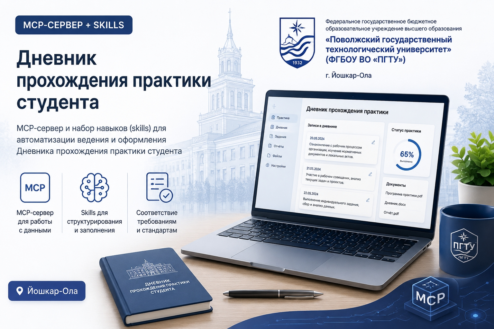

<div align="center">



# 📔 Дневник практики — ИИ-помощник для оформления

**Наговори данные в свободной форме — получи готовый «Дневник практики» ПГТУ в .docx. Работает с любым популярным ИИ.**

[](#)
[](https://www.npmjs.com/package/dnevnik-praktiki-pgtu)
[](https://github.com/panasociable/Skill-fo-practice-diary)
[](LICENSE)
[](#)
[](#)
[](#)

</div>

---

## Что это

Помощник, который оформляет официальный **«Дневник практики»** Поволжского
государственного технологического университета (ПГТУ).

Студент просто рассказывает о себе и месте практики — голосом или текстом, в
свободной форме. ИИ понимает, что речь о дневнике практики, вытаскивает из
рассказа нужные поля, уточняет недостающее одним коротким вопросом и выдаёт
заполненный `.docx` строго по шаблону вуза.

Под капотом — обычный Python-скрипт и шаблон `.docx`, поэтому проект не привязан
к одному ассистенту и работает с любым ИИ, который умеет выполнять код.

## Зачем

Заполнять дневник руками — нудно: одни и те же ФИО, кафедра, сроки, план из
8 пунктов с датами. Помощник делает это за секунды и не ошибается в формате.

## Поддержка ИИ

| Ассистент | Как использовать |
|-----------|------------------|
| **Claude** (Cowork / Claude Code) | Установить как skill (`skills/dnevnik-praktiki`) — ИИ сам спросит данные и пришлёт документ |
| **ChatGPT** (с Code Interpreter / Data Analysis) | Загрузить `fill_diary.py` и `template.docx`, вставить промпт ниже |
| **Gemini** (с выполнением кода) | То же: загрузить файлы скрипта и шаблона, вставить промпт |
| **DeepSeek и другие** с запуском кода | То же — загрузить файлы и дать промпт |
| **GigaChat** (через API) | Установить зависимости, задать ключи в `.env`, вызвать `providers/gigachat_client.py` |
| **Яндекс GPT** (через API) | Установить зависимости, задать ключи в `.env`, вызвать `providers/yandex_gpt_client.py` |
| Любой ИИ **без** запуска кода | Может заполнить шаблон вручную, но это менее надёжно — рекомендуется ассистент с выполнением кода |

## Как пользоваться

### Вариант 1 — Claude (нативно, как skill)

1. Установите скилл из папки `skills/dnevnik-praktiki`.
2. Напишите в свободной форме:

   > Оформи дневник практики. Я Иванов Иван Иванович, группа ИСТ-31, 3 курс,
   > кафедра информационных систем, практика в ООО «ТехноСофт» с 29 июня по
   > 12 июля, тема — разработка модуля учёта заявок.

3. Claude уточнит, чего не хватает, и пришлёт готовый документ.

### Вариант 2 — ChatGPT, Gemini, DeepSeek и др.

1. Загрузите в чат два файла: `skills/dnevnik-praktiki/scripts/fill_diary.py` и
   `skills/dnevnik-praktiki/assets/template.docx`.
2. Вставьте универсальный промпт из [`AI_PROMPT.md`](AI_PROMPT.md) и добавьте свои
   данные в свободной форме.
3. ИИ соберёт данные в JSON, запустит скрипт и вернёт готовый `.docx`.


### Вариант 3 — GigaChat (через API)

1. Получите `client_id` и `client_secret` на [developers.sber.ru](https://developers.sber.ru/portal/products/gigachat).
2. Скопируйте `.env.example` в `.env` и заполните `GIGACHAT_CREDENTIALS` и `GIGACHAT_SCOPE`.
3. Установите зависимости и запустите:

   ```bash
   pip install -r requirements.txt
   python providers/gigachat_client.py
   ```

4. Импортируйте в свой скрипт:

   ```python
   from providers.gigachat_client import ask
   reply = ask("Оформи дневник практики. Я Иванов Иван...")
   ```

### Вариант 4 — Яндекс GPT (через API)

1. Создайте сервисный аккаунт в [Yandex Cloud](https://cloud.yandex.ru/) с ролью `ai.languageModels.user`.
2. Скопируйте `.env.example` в `.env` и заполните `YANDEX_FOLDER_ID` и `YANDEX_API_KEY`.
3. Установите зависимости и запустите:

   ```bash
   pip install -r requirements.txt
   python providers/yandex_gpt_client.py
   ```

4. Импортируйте в свой скрипт:

   ```python
   from providers.yandex_gpt_client import ask
   reply = ask("Оформи дневник практики. Я Иванов Иван...")
   ```

## Что внутри

```
skills/dnevnik-praktiki/
├── SKILL.md                  # инструкции для Claude: что спрашивать и как собирать
├── scripts/
│   └── fill_diary.py         # подстановка данных в шаблон + расчёт дат плана
└── assets/
    ├── template.docx         # шаблон ПГТУ с плейсхолдерами {{...}}
    └── data_example.json     # пример входных данных
AI_PROMPT.md                  # универсальный промпт для любого ИИ
requirements.txt              # зависимости (python-docx)
tests/
└── test_fill_diary.py        # автотест: генерация из примера + нет {{...}}
tools/
├── build_template.py         # как из исходного дневника собран шаблон
└── template_src.docx         # исходный документ-образец
```

## Запуск скрипта вручную

```bash
pip install -r requirements.txt
python3 skills/dnevnik-praktiki/scripts/fill_diary.py data.json "Дневник_Иванов.docx"
```

> На некоторых Linux pip требует флаг `--break-system-packages`. На Windows и в
> виртуальном окружении (`venv`) он не нужен.

## Тесты

```bash
pip install -r requirements.txt
python3 tests/test_fill_diary.py     # или: pytest
```

## Поля

| Поле | Обязательно | Описание |
|------|:----------:|----------|
| `fio` | да | ФИО студента полностью |
| `kafedra` | да | кафедра / факультет |
| `spec` | да | специальность с кодом |
| `kurs`, `gruppa` | да | курс и группа |
| `mesto` | да | место прохождения практики |
| `start_date`, `end_date` | да | сроки, формат `ГГГГ-ММ-ДД` |
| `zadanie` | да | индивидуальное задание / содержание отчёта |
| `vid`, `tip`, `forma` | нет | вид/тип практики, форма обучения |
| `prikaz_n/date`, `dog_n/date`, `instr_vuz`, `instr_org` | нет | если нет — в документе остаются прочерки |

> План работ из 8 пунктов и распределение дат по срокам считаются
> автоматически — отдельно вводить не нужно.

## Лицензия

MIT — см. [LICENSE](LICENSE).
